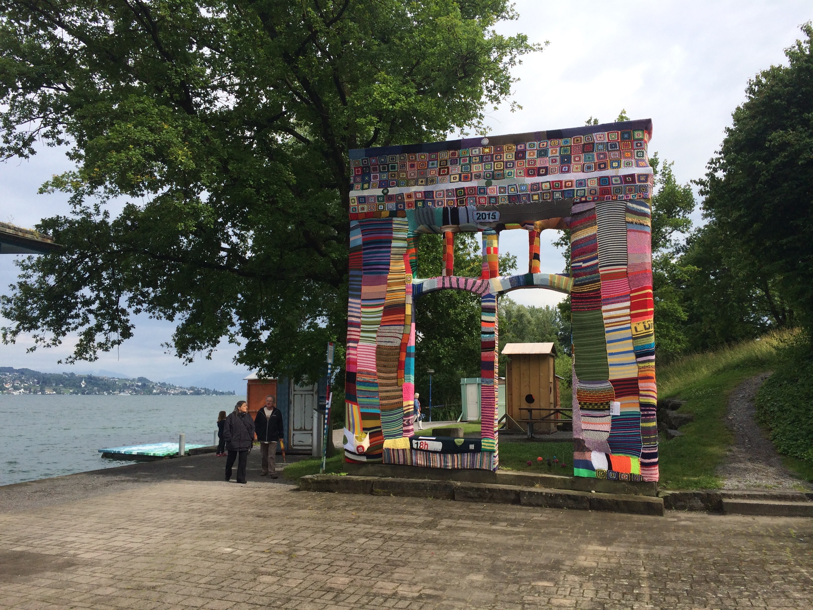
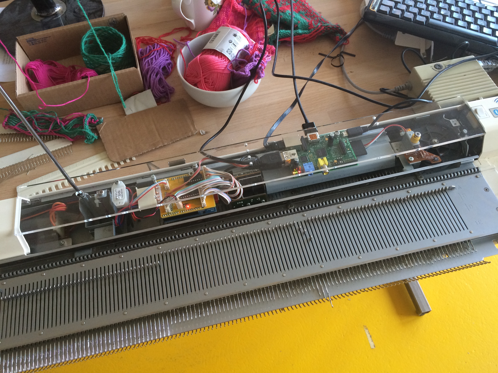
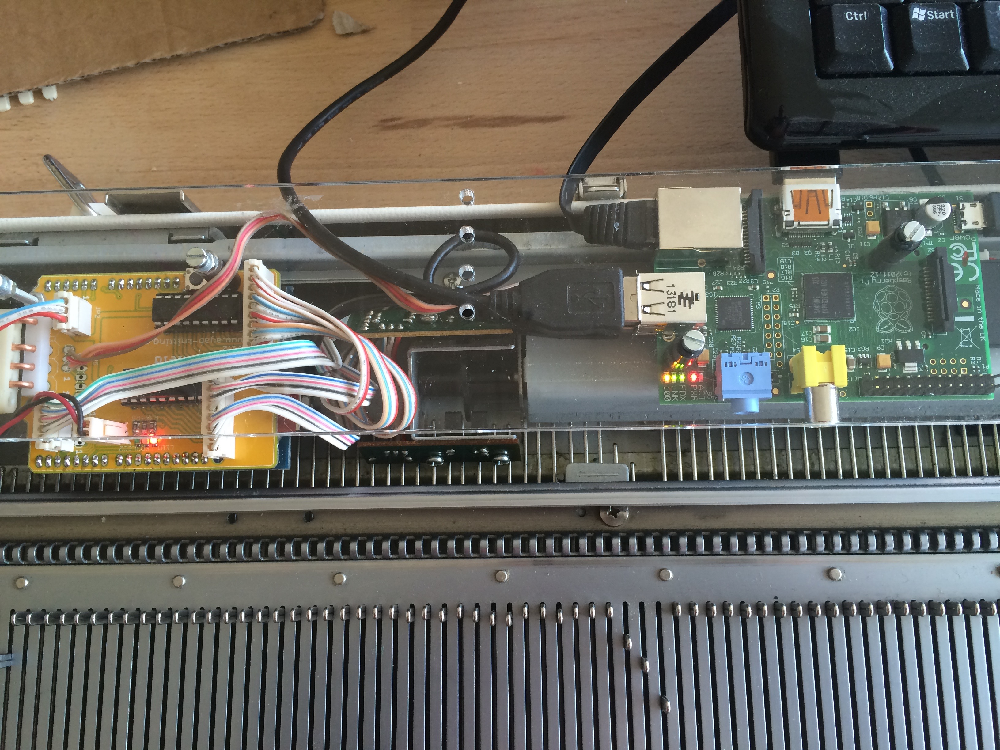
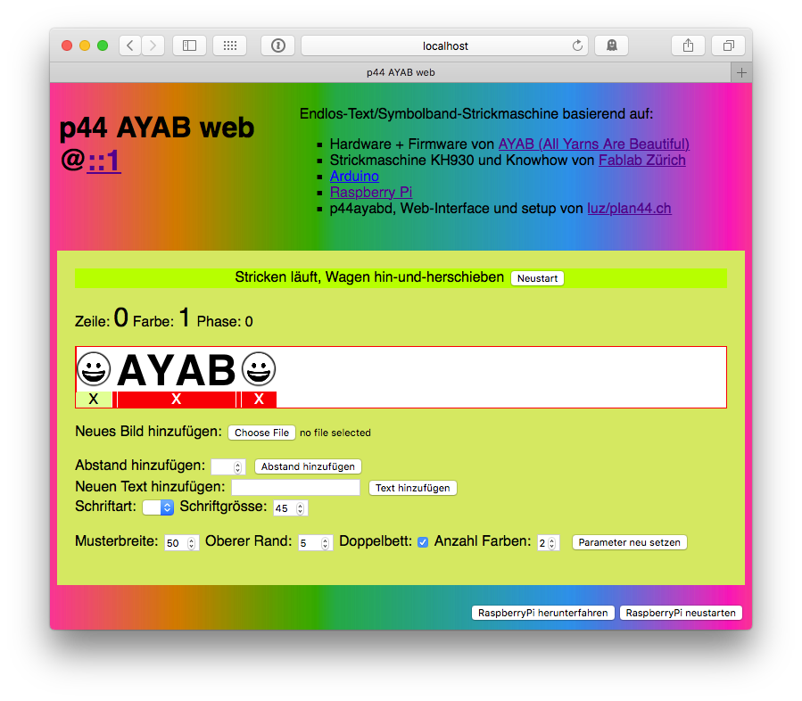

# p44ayabd - Text Banner Knitting using AYAB and a RaspberryPi

- original Version 2015
- updated November 2017

## Goal

As part of an outdoor guerilla knitting event in June 2015, we wanted to be able to knit text banners of arbitrary length on a KH930, with new text being suggested by the audience and being added to banners already being knitted.

So requirements were:

- simple to use for people at the event
- allow adding text without need for an image processing app
- still allow adding prepared picture files for symbols, icons etc.
- allow preparing new text and images while knitting
- self contained, integrated into the knitting machine as much as possible
- failure tolerant, should survive accidental powerdown, restart of the
  AYAB, restart of the Raspberry
  
## Results

At the *Wellensalat* event, some of the knitted banners were integrated into a bigger cooperative knitting project, some were installed along fences around the site. In a later event *Verstrickte Worte* we've used the setup again, we took suggestions for words and small sentences to knit on the spot from the audience and gave away the banners to those that asked (mostly children).

*[Wellensalat](http://www.wellensalat.ch/galerie.html) @ Kulturtage Thalwil 2015*

*Verstrickte Worte @ Jenseits der Hecke, [Gleis70](http://gleis70.ch), Chreis9-Fest Zürich*

## Project components

- The Knitting machine

- The [AYAB](http://ayab-knitting.com) project's arduino shield (available at [TinkerSoup](https://www.tinkersoup.de/arduino/arduino-shields/ayab-shield/a-1286/)) and the original AYAB [firmware](https://bitbucket.org/chris007de/ayab-apparat/src/7484876e04c1597ecf66c4becad6f500fed28ac4/firmware/?at=master) on an Arduino UNO. AYAB is a plug-in, reversable replacement for the original KH9xx electronics. It works for KH910,930 and 940 and provides the [AYAB serial communication protocol](https://bitbucket.org/chris007de/ayab-apparat/wiki/english/Software/SerialCommunication) to control knitting. 

- A [RaspberryPi](https://www.raspberrypi.org) Model B+ (but B, 2 or 3 will do as well) with [Raspian Linux](http://www.raspbian.org), connected to the AYAB Arduino via USB for hosting the higher level software and data (p44ayabd, web server, php, images, fonts etc.)

- The p44ayabd program, written in C++. It runs as a daemon (supervised by [runit](http://smarden.org/runit/)) on the Raspberry. It talks via USB serial port to the AYAB arduino firmware on one side, and offers a JSON API on the other side to control knitting and manage an internal queue of images to knit. It saves its state in regular intervals to keep up knitting at the same point in case something crashes or needs to be restarted.

- A Web page written in PHP hosted on Raspian's Apache web server. The web interface allows adding or removing patterns to the knitting queue, either by uploading prepared images or creating new images on the fly from text input using [ImageMagic](http://imagemagick.org/script/index.php) ([php5-imagick](http://php.net/manual/en/book.imagick.php)). The web interface can be used from the Raspian desktop itself, or remotely from any standard browser.

- Setup of raspian: p44ayabd always running, web site is advertised via Bonjour/Avahi, with automatic link-local IP address assignment, so an external computer can be connected via a RJ45 cable to the RPi when no LAN with DHCP is available.

- Mechanical mounting: A lasercut plexiglass plate, which fits to replace the original KH930 electronics, with holes to hold RPi B+ and AYAB+Arduino underneath.

## How to set up

### Hardware parts needed

1. A KH910, KH930 or KH940 knitting machine. Thanks to [Fablab Zürich](http://zurich.fablab.ch) for lending us their KH940 for the first installation (by now I have my own KH930)!
2. An AYAB shield for your machine (there are two different versions for KH910 and KH930/940), available from [ThinkStack](https://shop.thinkstack.de/gb/).
3. A standard size Arduino. I used an UNO, a more recent version should do as well.
4. **Note:** As an alternative to 2 and 3 above, a **combined AYAB+Arduino board** that nicely fits into KH9xx machines is [available from Evil Mad Scientist](https://shop.evilmadscientist.com/productsmenu/835).
4. A Raspberry Pi. In the original installation, I used an older Model B which works fine. But when building it a second time now, I took a B+ which is more convenient because it has 4 USB ports, so you can connect AYAB, a mouse and a keyboard directly.
5. A suitable SD Card. If you want to use current (as per November 2017) Raspian, you need 8GB; I am using Raspian *Jessie* where you can get along with 4GB.
6. The mounting plate. I used a piece of plexiglass, and had it lasercut at [Fablab Zürich](http://zurich.fablab.ch) to 570mm x 65mm, including all needed holes. See *mounting-plate/p44ayab_mount_v2_rpi_bplus.pdf* file.
7. a USB cable with small connectors (not much space)
8. Some M3 screws, cable straps, spacer bolts.

### AYAB Setup

1.	assemble and install the AYAB shield (see [instruction manual PDF for v1.3th](https://github.com/AllYarnsAreBeautiful/ayab-manuals/raw/master/soldering/en/soldering_en.pdf) - or [same in german](https://github.com/AllYarnsAreBeautiful/ayab-manuals/raw/master/soldering/de/soldering_de.pdf) or their [tutorial video](http://vimeo.com/99870358))

2. Note that there are different versions of the AYAB shield. v1.2 (my original AYAB shield) and earlier used PCF8574, v1.3th (my current AYAB) and newer shields use MCP2300x. The latter does not work with older firmware.
A copy of the specific firmware version that I am using today (second iteration of this hack, 2017) is in the `ayab_firmware` folder. Use the arduino IDE to install it:
   1. copy the contents of the `needed_arduino_libraries` folder into your Arduino library folder (on macOS: `~/Documents/Arduino/libraries`)
   2. open the sketch `ayab.ino` from the `ayab` folder.
   3. Compile and install it using the Arduino IDE (there are a few compiler warnings, but installation should still work)
 
Here are two pictures of fablab's KH940 with AYAB shield and RPi mounted.

*Note: while the transparent set up looks nice, it might not be optimal as light possibly sometimes causes encoder misreadings which result in strange glitches in the knitted pattern. But as the audience often liked the glitches, I did not bother to shield the encoder so far :-)* 

### Raspberry Pi Setup

The complete setup, including building p44ayabd from sources, and all steps to configure raspian for standalone AYAB operation are described below.

## Complete Software setup on Raspberry Pi

### Raspian

1. Install a plain rasbian (many RPis are delivered with a SD Card already containing NOOBS, which includes a Raspian install option). Otherwise, [download a NOOBS or Raspian image](https://www.raspberrypi.org/downloads/) and follow their instructions to copy it to the SD Card.

2. Use raspi-config (auto-starts at first boot) to expand the file system and to give the Rpi a suitable name (mine is called "ayabpi").

**Note:** if you want to fit everything into a 4GB card, start with an older Raspian ([*Jessie* from November 2015](https://downloads.raspberrypi.org/raspbian/images/raspbian-2015-11-24/2015-11-21-raspbian-jessie.zip) is just below 4GB). To gain around 400MB of free space, delete some big packages, for example:

    # frees about 400M
    apt-get remove bluej libreoffice scratch supercollider xpdf sonic-pi
    apt-get autoremove

### Compiling p44ayabd

Install the dependencies (takes a lot of time, as it includes installing the gcc toolchain):

	sudo apt-get update
	sudo apt-get install git
	sudo apt-get install autoconf
	sudo apt-get install libjson0-dev libboost1.50-dev libi2c-dev

Clone the p44ayabd repository (and the p44utils submodule):

	cd ~
	git clone https://github.com/plan44/p44ayabd
	git submodule init
	git submodule update

We need `libpng16` and not `libpng12` which Raspian has by default (that is - *had* at the time of writing this in 2017), so we need to build and install `libpng16` manually:

	cd ~
	wget -O libpng.tar.xz http://sourceforge.net/projects/libpng/files/latest/download?source=files
	tar --xz -xf libpng.tar.xz
	cd libpng-1.6.32
	./configure
	make
	sudo make install

Now build and install p44ayabd (takes a while on the RPi, especially on older B+)

	cd ~/p44ayabd
	autoreconf --force --install
	./configure
	make
	sudo make install

### runit daemon supervisor

Install it

	sudo apt-get install runit

Install service files for p44ayabd

	cd ~/p44ayabd
	sudo cp -r service/* /etc/service
	
### the php website

Install imagick, apache, php5

	apt-get install apache2 libapache2-mod-php5 php5-imagick
	
copy web contents

	cd /var/www/html
	sudo cp -r ~/p44ayabd/p44ayabweb/* .
	
make imgs writable for all (so web server and p44ayabd can write it)

	sudo chmod 777 imgs

disable existing index.html because that's what apache2 uses first

	sudo mv index.html index.html.disabled

enable Apache to collect PATH_INFO by inserting...

    <Directory /var/www/html>
        AcceptPathInfo On
    </Directory>

...into the apache configuration files configuration for http and https default websites

	sudo pico /etc/apache2/sites-available/000-default.conf
	sudo pico /etc/apache2/sites-available/default-ssl.conf
	
Now, reboot the Rpi, and afterwards you should be able to access the p44ayabd website either from the web browser from the RPi desktop or from any browser in the LAN.

It will look like this:

I hope the UI is more or less self-explanatory (even if currently in German only).

You can add text (or images) in segments to the queue, click to re-position the knitting cursor, remove text segments already or not yet knitted, select a font and also restart the AYAB in case something goes wrong.

Even if someone trips over the power cord and reboots the Rpi, the queue, pattern width and cursor is preserved and you should be able to continue knitting where you left off.

Happy text banner knitting!

