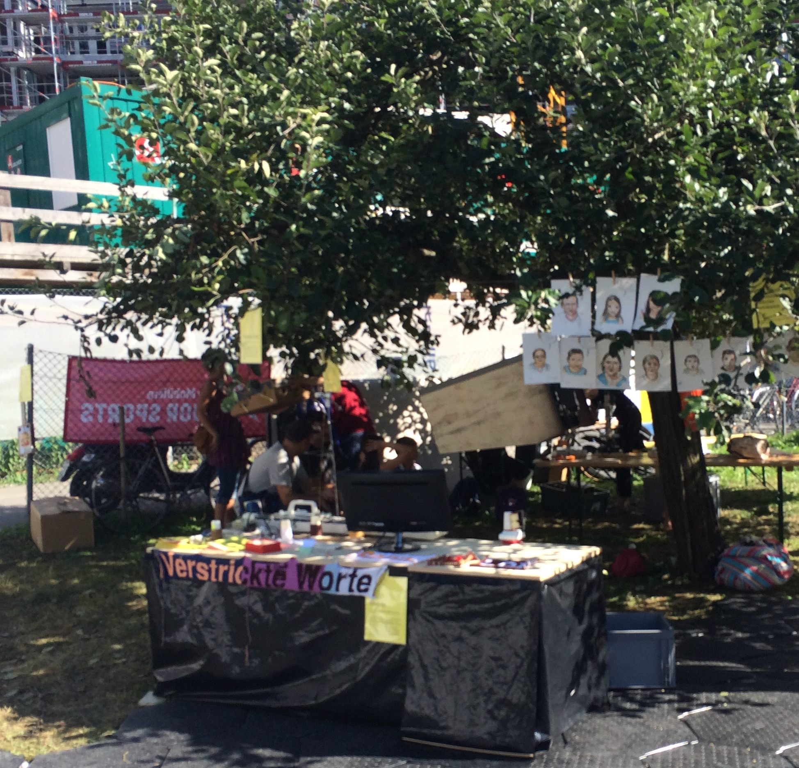

# p44ayabd - Text Banner Knitting using AYAB and a RaspberryPi

## Goal

As part of an outdoor guerilla knitting event in June 2015, we wanted to be able to knit text banners of arbitrary length on a KH930, with new text being suggested by the audience and being added to banners already being knitted.

So requirements were:

- simple to use for people at the event
- allow adding text without need for an image processing app
- still allow adding prepared picture files for symbols, icons etc.
- allow preparing new text and images while knitting
- self contained, integrated into the knitting machine as much as possible
- failure tolerant, should survive accidental powerdown, restart of the
  AYAB, restart of the Raspberry
  
## Results

At the *Wellensalat* event, some of the knitted banners were integrated into a bigger cooperative knitting project, some were installed along fences around the site. In a later event *Verstrickte Worte* we've used the setup again, we took suggestions for words and small sentences to knit on the spot from the audience and gave away the banners to those that asked (mostly children).

*[Wellensalat](http://www.wellensalat.ch/galerie.html) @ Kulturtage Thalwil 2015*

*Verstrickte Worte @ Jenseits der Hecke, [Gleis70](http://gleis70.ch), Chreis9-Fest Zürich*

## Project components

- The [AYAB](http://ayab-knitting.com) project's arduino shield (available at [TinkerSoup](https://www.tinkersoup.de/arduino/arduino-shields/ayab-shield/a-1286/)) and the original AYAB [firmware](https://bitbucket.org/chris007de/ayab-apparat/src/7484876e04c1597ecf66c4becad6f500fed28ac4/firmware/?at=master) on an Arduino UNO. AYAB is a plug-in, reversable replacement for the original KH9xx electronics. It works for KH910,930 and 940 and provides the [AYAB serial communication protocol](https://bitbucket.org/chris007de/ayab-apparat/wiki/english/Software/SerialCommunication) to control knitting. 

- A [RaspberryPi](https://www.raspberrypi.org) Model B (but B+ or 2 will do as well) with [Raspian Linux](http://www.raspbian.org), connected to the AYAB Arduino via USB for hosting the higher level software and data (p44ayabd, web server, php, images, fonts etc.)

- The p44ayabd program, written in C++. It runs as a daemon (supervised by [runit](http://smarden.org/runit/)) on the Raspberry. It talks via USB serial port to the AYAB arduino firmware on one side, and offers a JSON API on the other side to control knitting and manage an internal queue of images to knit. It saves its state in regular intervals to keep up knitting at the same point in case something crashes or needs to be restarted.

- A Web page written in PHP hosted on Raspian's Apache web server. The web interface allows adding or removing patterns to the knitting queue, either by uploading prepared images or creating new images on the fly from text input using [ImageMagic](http://imagemagick.org/script/index.php) ([php5-imagick](http://php.net/manual/en/book.imagick.php)). The web interface can be used from the Raspian desktop itself, or remotely from any standard browser.

- Setup of raspian: p44ayabd always running, web site is advertised via Bonjour/Avahi, automatic link-local IP address assignment so an external computer can be connected via a RJ45 cable to the RPi when no LAN with DHCP is available.

- Mechanical mounting: A lasercut plexiglass plate, which fits to replace the original KH930 electronics, with holes to hold RPi and AYAB+Arduino underneath.

## How to set up

### Hardware parts needed

1. A KH910, KH930 or KH940 knitting machine. Thanks to [Fablab Zürich](http://zurich.fablab.ch) for lending us their KH930!
2. An AYAB shield for your machine (there are two different versions for KH910 and KH930/940), available from [TinkerSoup](https://www.tinkersoup.de/arduino/arduino-shields/ayab-shield/a-1286/)
3. A standard size Arduino. I used an UNO, a more recent version should do as well.
4. A Raspberry Pi, I used an older Model B which is by far good enough, but B+ and 2 work as well, with a suitable (>=4GB) SD Card.
5. The mounting plate. I used a piece of plexiglass, and had it lasercut at [Fablab Zürich](http://zurich.fablab.ch) to 570mm x 65mm, including all needed holes. See *mounting-plate/p44ayab_mount.dxf* file, layer0 contains the outline and holes.
6. a USB cable with small connectors (not much space)
7. Some M3 screws, cable straps, spacer bolts.

### AYAB Setup

1.	assemble and install the AYAB shield (see their [tutorial video](http://vimeo.com/99870358) and [wiki](https://bitbucket.org/chris007de/ayab-apparat/wiki/Home))

2. Install the AYAB firmware. There is a [video](https://vimeo.com/105064325) for that as well, otherwise follow the instructions in the [AYAB wiki](https://bitbucket.org/chris007de/ayab-apparat/wiki/english/Home) Note: the only part we need is the AYAB Arduino firmware.

Here are two pictures of our KH940 with AYAB shield and RPi mounted.

*Note: while the transparent set up looks nice, it might not be optimal as light possibly sometimes causes encoder misreadings which result in strange glitches in the knitted pattern. But as the audience often liked the glitches, I did not bother to shield the encoder so far :-)* 

### Raspberry Pi Setup

The complete setup, including building p44ayabd from sources, and all steps to configure raspian for standalone AYAB operation are described below.

## Complete Software setup on Raspberry Pi

### Raspian

1. Install a plain rasbian (many RPis are delivered with a SD Card already containing NOOBS, which includes a Raspian install option). Otherwise, [download a NOOBS or Raspian image](https://www.raspberrypi.org/downloads/) and follow their instructions to copy it to the SD Card.

2. Use raspi-config (auto-starts at first boot) to expand the file system and to give the Rpi a suitable name (mine is called "ayabpi").

### Compiling p44ayabd

Install the dependencies (takes a lot of time, as it includes installing the gcc toolchain):

	sudo apt-get update
	sudo apt-get install git
	sudo apt-get install autoconf
	sudo apt-get install libjson0-dev libboost1.50-dev libi2c-dev

Clone the p44ayabd repository

	cd ~
	git clone https://github.com/plan44/p44ayabd

We need a newer libpng than what Raspian has by default (that is - *had* at the time of writing this in 2015 - so you might be able to replace this step by simply *apt-get install libpng-dev* on a newer Raspian):

	cd ~
	wget -O libpng.tar.xz http://sourceforge.net/projects/libpng/files/latest/download?source=files
	tar --xz -xf libpng.tar.xz
	cd libpng-1.6.17
	./configure
	make
	sudo make install
	# create a link so p44ayabd will find it
	sudo ln -s /usr/local/lib/libpng16.so.16 /usr/lib/libpng16.so.16

Now build and install p44ayabd (takes a while on the RPi)

	cd ~/p44ayabd
	autoreconf --force --install
	./configure
	make
	sudo make install

### runit daemon supervisor

Install it

	sudo apt-get install runit

Install service files for p44ayabd

	cd ~/p44ayabd
	sudo cp -r service/* /etc/service
	
### the php website

Install Imagick (this pulls apache, php etc. as dependencies)

	apt-get install php5-imagick
	
copy web contents

	cd /var/www
	sudo cp -r ~/p44ayabd/p44ayabweb/* .
	
make imgs writable for all (so web server and p44ayabd can write it)

	sudo chmod 777 imgs

disable existing index.html because that's what apache2 uses first

	sudo mv index.html index.html.disabled

enable Apache to collect PATH_INFO

edit /etc/apache2/sites-available/default and default-ssl and insert
*AcceptPathInfo On* into configuration for /var/www directory

	sudo pico /etc/apache2/sites-available/default
	sudo pico /etc/apache2/sites-available/default-ssl
	
Now, either reboot the Rpi, and afterwards you should be able to access the p44ayabd website either from the web browser from the RPi desktop or from any browser in the LAN.

It will look like this:

I hope the UI is more or less self-explanatory (even if currently in German only).

You can add text (or images) in segments to the queue, click to re-position the knitting cursor, remove text segments alredy or not yet knitted, select a font and also restart the AYAB in case something goes wrong.

Even if someone trips over the power cord and reboots the Rpi, the queue, pattern width and cursor is preserved and you should be able to continue knitting where you left off.

Happy text banner knitting!

